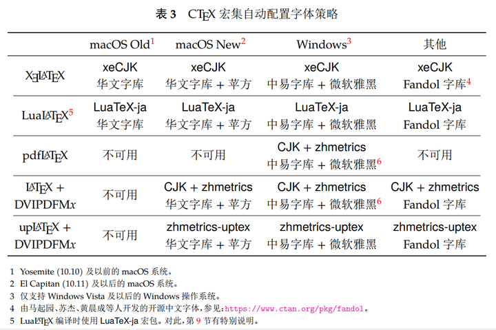

# Notes Helps

针对学习和工作中使用 $\LaTeX$ 与`Markdown`的使用帮助清单，已在`Linux(Ubuntu 22.04)`、`Linux(Wsl-Ubuntu 22.04)`、`Windows 11`实现部署与验证。

# Latex

$\LaTeX$ 是一个文档准备系统 (Document Preparing System)，它非常适用于生成高印刷质量的科技类和数学类文档。它也能够生成所有其他种类的文档，小到简单的信件，大到完整的书籍。 $\LaTeX$ 使用 $\TeX$ 作为它的排版引擎，学习 $\LaTeX$ 是一个漫长而痛苦的过程，我们应该充分利用已知的资料，来尽量完成我们的需求。

本仓库使用的 $\TeX$ 版本：

```shell
TeX 3.141592653 (TeX Live 2022/dev/Debian)
kpathsea version 6.3.4/dev
Copyright 2021 D.E. Knuth.
```

## 使用帮助

### 安装

安装方法：参照[TeX Live](https://tug.org/texlive/) 中选择对应`OS`的安装方法即可，下面给出`Linux(Ubuntu)`中的安装方法。

`Linux(Ubuntu)`安装方法（建议）：

```shell
sudo apt update
sudo apt upgrade
sudo apt install texlive-full
```

### 基础教程

本仓库不提供具体教程，新手可以阅读 [Ishort-zh-cn](https://mirror-hk.koddos.net/CTAN/info/lshort/chinese/lshort-zh-cn.pdf) 入门，这几乎是最好的入门教程。

本仓库的 [Easy-Latex](https://github.com/3000ye/Notes-tools/blob/main/Easy-Latex.md) 也给出了一些常用的排版模板。

### 字体设置

由于 $\LaTeX$ 默认只有英文输出，因此对于国内 $\LaTeX$ 新手而言，如何输出中文是第一大坑。

#### 英文字体

英文字体的简单自定义可以使用如下代码：

```tex
\setmainfont{Times New Roman} % 设置主字体为新罗马体
```

#### 中文字体说明

目前，$\LaTeX$ 主流中文文档类支持是通过`ctex`宏包，使用`xelatex + ctex`编译方案，其中底层宏包为`xeCJK`。



上图可以看出，在`Linux`平台中`ctex`默认字体为`Fandol`，而`Windows`平台默认字体为**中易字库与微软雅黑**。

而诸如`Unubtu`等发行版并不自带`Fandol`字库，本仓库已上传至[Fonts](https://github.com/3000ye/Notes-tools/tree/main/Fonts)。或者访问[作者网页](https://www.ctan.org/pkg/fandol)获取。

#### 中文字体使用

如果使用`ctex`默认字体，则只需在导言区加入如下代码：

```tex
% 字体设置
\usepackage[UTF8]{ctex}
\usepackage{fontspec} % 设置字体
```

如需自定义字体，则可简单参照以下格式：

```tex
\usepackage[UTF8, fontset=none]{ctex}  % 清除默认字体
\usepackage{fontspec}  % 设置字体
\setCJKmainfont{SimSun}[AutoFakeBold=true, BoldFont={SimHei}, ItalicFont={KaiTi}]  % 正文字体
\setCJKsansfont[AutoFakeBold=3]{KaiTi} % 无衬线字体
\setCJKmonofont[AutoFakeBold=3]{SimHei} % 等宽字体
```

具体字体使用可以参阅[LaTeX 中文字体配置基础指南](https://zhuanlan.zhihu.com/p/538459335)。

## 编辑器选择

市面上有很多 $\LaTeX$ 编辑器，下面是一些**主观**评价：

- `TexStudio`：几乎所有教程都推荐的编辑器，但我觉得界面过于丑陋所以基本没用过，优点是免费。
- `Winedt`：`Windows`平台最强大的 $\LaTeX$ 编辑器，我的主力编辑器之一。优点是完全的自定义与完美的界面设计，使用体验好比`IDEA`之于`Java`，缺点是`Windows`独占。
- `Vs Code`：作为地表最强编辑器，`Vs Code`也能实现完美编辑 $\LaTeX$，并全平台通用，缺点是配置较为繁琐。
- `Overleaf`：在线的 $\LaTeX$ 编辑器，个人觉得可以作为体验 $\LaTeX$ 而简单使用，因其为在线编辑器，并不建议高强度使用。

下面根据我自身使用情况，介绍`Winedt`与`Vs Code`的使用配置。

### Winedt

建议安装最新版的`Winedt 11`，这一版本内置了`PDF`阅读器，自带双向索引，但需要付费购买（买断制）。

`Winedt`的使用对于新手非常友好，且其非双栏设计也不会降低输入效率。相较于其他 $\LaTeX$ 编辑器的默认双栏，个人认为使用 $\LaTeX$ 的精髓就在于抛弃`Word`的所见即所得，达到随心所欲，在`tex`代码中遨游。

相对的，如果你已经习惯了`Word`中的一些快捷键，那么建议你在`Winedt`中使用同样的设置。同时，`Winedt`也支持代码片段`snippet`，配置可参考：[Winedt-HotKey](https://github.com/3000ye/Notes-tools/blob/main/Winedt-HotKey.md) 。

### Vs Code

如果你有多平台同步使用的需求，那么我建议你使用`Vs Code`来配置你的 $\LaTeX$ 编辑环境。这类文章网上已经有许多了，本文不再赘述。

# Markdown

`Markdown`是一种轻量级标记语言，排版语法简洁，让人们更多地关注内容本身而非排版。它使用易读易写的纯文本格式编写文档，可与`HTML`混编，可导出`HTML`、`PDF`以及本身的 `.md`格式的文件。

## 使用帮助

`Markdown`的语法非常简单，本文不再赘述。

## 编辑器选择

几乎市面上所有的编辑器都支持`Markdown`，本文仅对个人经常使用的编辑器做介绍：

- `Typora`：个人认为最好用的编辑器，简洁而优雅，配合自定义`Themes`可以得到最舒适的`Markdown`编辑体验。
- `Obsidian`：与`Typora`的简洁与优雅相对应，`Obsidian`更像是一个`Markdown`的`IDE`，以项目管理的形式管理文件。如果你有非常多、密集度高的`Markdown`文件，那么建议你使用它。

### Typora

这里主要对我个人使用的一些`Theme`进行一个备份，可见目录：。

